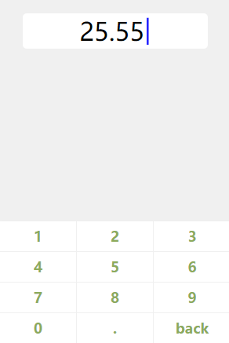

# number-keyboard
- mobile number keyboard
- need jquery or zepto

## use

```
  <link rel="stylesheet" href="keyboard.min.css">
  <script src="https://cdn.bootcss.com/zepto/1.2.0/zepto.min.js"></script>
  <script src="keyboard.min.js"></script>

  $('.modinput').keyboard('.input-hk').on('kbtap', function (e, value) {
      console.log('kbtap:' + value)
  })
```

